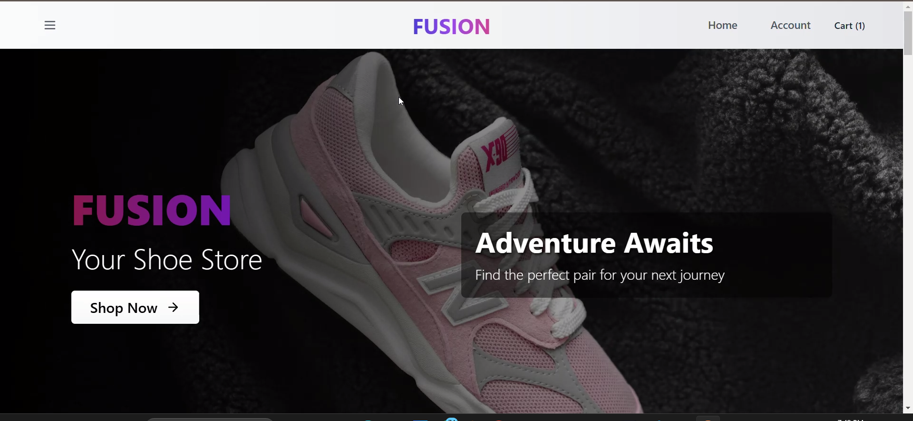
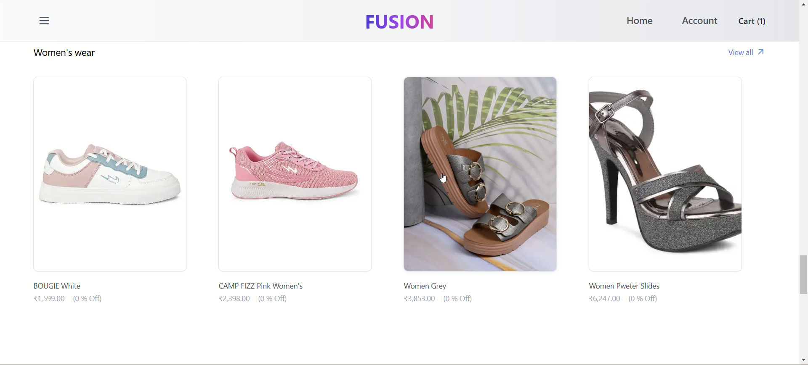
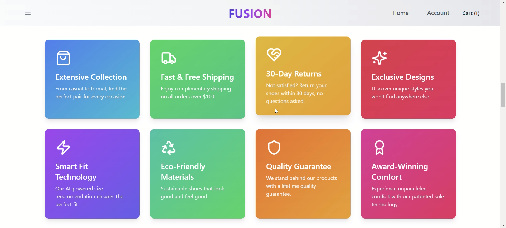

# 🚀 Fusion - Premium Footwear E-commerce Platform




## 🌟 Overview

Fusion is a modern e-commerce platform specializing in premium footwear. We're redefining what it means to walk in style by combining fashion-forward designs with unparalleled comfort.

## ✨ Features

### 🛍️ Shopping Experience
- **Extensive Collection** - From casual to formal, find the perfect pair for every occasion
- **Smart Fit Technology** - AI-powered size recommendations for the perfect fit
- **Product Categories** - Organized sections for Men's and Women's wear
- **Detailed Product Views** - High-quality images and comprehensive product information

### 💫 Customer Benefits
- **Fast & Free Shipping** - Complimentary shipping on orders over ₹100
- **30-Day Returns** - Hassle-free return policy
- **Quality Guarantee** - Lifetime quality assurance on all products
- **Exclusive Designs** - Unique styles you won't find elsewhere

### 🌱 Sustainability
- **Eco-Friendly Materials** - Sustainable shoes that look good and feel good
- **Responsible Manufacturing** - Commitment to ethical production practices

### 🔒 User Features
- **Secure Authentication** - Protected user accounts and data
- **Shopping Cart** - Seamless checkout experience
- **Order Tracking** - Real-time updates on your purchases
- **Newsletter Subscription** - Stay updated with latest trends and offers

## 🛠️ Technology Stack

- **Frontend**: Next.js, Medusa, Tailwind CSS
- **Backend**: Medusa
- **Database**: Medusa
- **Authentication**: NextAuth.js

## 📱 Responsive Design

Fully responsive design that works seamlessly across:
- Desktop
- Tablet
- Mobile devices

## 🚀 Getting Started

1. Clone the repository
```bash
git clone (https://github.com/Ujjawal-04/Fusion.git)
```

2. Install dependencies
```bash
cd fusion
npm install
```

3. Set up environment variables
```bash
cp .env.example .env.local
```

4. Run the development server
```bash
npm run dev
```

## 📸 Screenshots

<details>
<summary>View Screenshots</summary>

### Homepage


### Product Catalog


### Shopping Cart


---

Made with ❤️ by the Fusion Team(Ujjawal)
